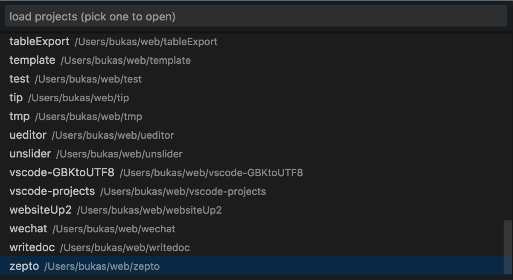

# projects

a vscode project manager extension

# Installation

Press `F1` in vscode, type `ext install` and then look for `projects`.

# Usage

## user settings

**projects.projectsLocation***

你所有的项目存放的文件夹的绝对路径，此文件夹下面的所有一级目录将为一个单独的项目。`default: $home/projects`

可用变量`$home`表示用户目录

```
"projects.projectsLocation": "$home/web"
```

**projects.showProjectNameInStatusBar**

是否在状态栏左下角显示当前项目名，点击项目名即可快速打开项目列表。`default: true`

```
"projects.showProjectNameInStatusBar": false
```


**projects.openInNewWindow**

是否以新窗口方式打开项目。`default: true`

```
"projects.openInNewWindow": false
```

**projects.ignoredFolders**

所有项目文件夹下忽略此种文件夹。`default:["node_modules"]`

```
"projects.ignoredFolders": ["node_modules"]
```

## commands

- projects.list
- projects.reload
- projects.cresate


